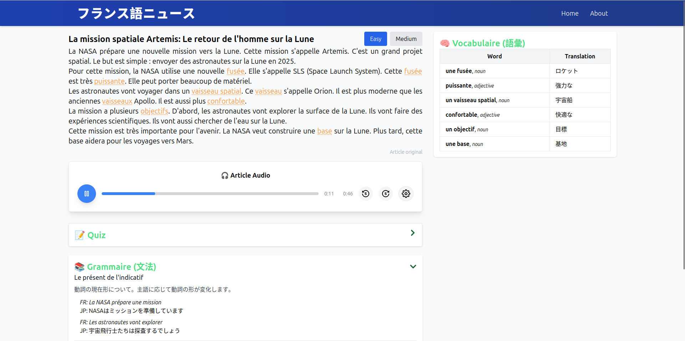

# 📰 French Easy News App

### 🌍 About the Project
The **French Easy News App** is designed for **native Japanese speakers** learning French. This platform delivers simplified French news articles, helping learners expand their vocabulary and improve grammar in a practical context.

The goal is to bridge the language gap by making French news more accessible and engaging to Japanese audiences, combining **language immersion with real-world content**.

---

### 🎯 Key Features

#### 📄 Read Simplified French News
- Curated French news articles presented in simple language.
- Interactive translations of complex vocabulary directly within the articles.
- Articles come in two difficulty levels (Easy and Medium).
- Articles are generated from real French news by ChatGPT.
  - each article is reviewed by a native French speaker before submission to ensure accuracy and authenticity.

#### 🗣️ Audio Support for Articles
- **Listen to the articles** in French with an integrated audio player.
- Pause and play buttons for easy control.
- Enhance your listening skills while following the text.
- Audio is generated by AI and has been carefully checked to ensure that French pronunciation is correct.

#### 📚 Interactive Vocabulary
- Hover over difficult words to see **translation**.
- A tooltip provides translation of difficult words.
- Vocabulary is highlighted for easy recognition.

#### 🧰 Vocabulary Table
- Each article comes with a **vocabulary list** at the end.
- Organized table view with French words and Japanese translations.

#### 📖 Grammar Learning
- Integrated **grammar sections** accompanying each article.
- Examples connecting grammar points to the article's content.
- Supports contextual learning with grammar explanations in Japanese.

### 📝 Quiz
- Integrated short **quiz** accompanying each article.
- Test the reading comprehension of the article.

---

### 🛠️ Tech Stack
- **Frontend**: Next.js, React, TailwindCSS
- **Backend**: Next.js
- **Database**: MongoDB
- **Audio**: HTML5 Audio API

### Mobile and Desktop
- Natively responsive and suited for both desktop and mobiles uses.

---

## Screenshots
